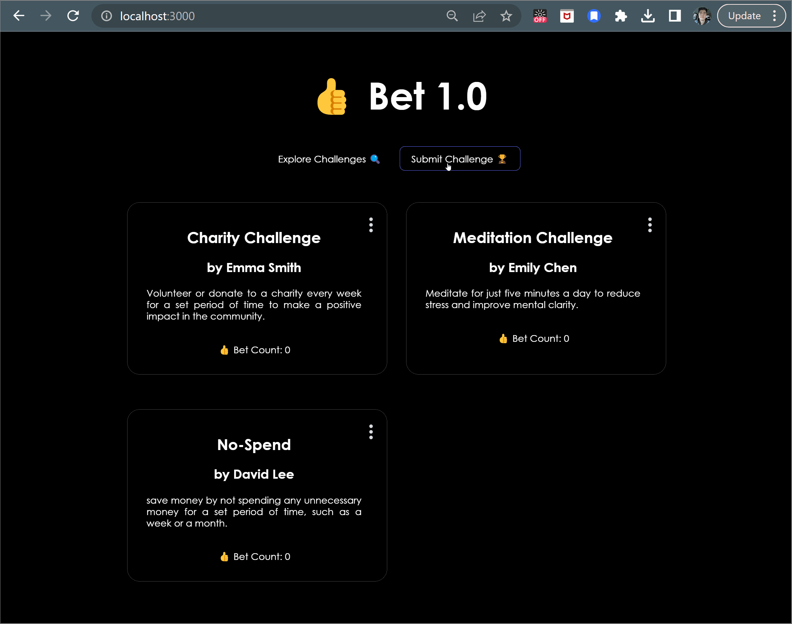

# Bet 1.0
Bet is a forum built for Gen Z thrill-seekers where users can post challenges for other users. Users can take on a challenge by clicking the “Bet” button.

## Video Walkthrough

Here's a walkthrough of implemented user stories:



<!-- Replace this with whatever GIF tool you used! -->
GIF created with [LiceCap](http://www.cockos.com/licecap/).


## Database
-   Setup and account and get an API key from CryptoCompare
-   Go to the [Supabase website](https://supabase.com/) and make a free account with your email. 
-   Create a new project:
    Click the green "New Project" button to create a new project
    Set the name of your project to bet and create a database password
    Click the green "Create new project" button to submit to form
    After submitting the form, give Supabase a few minutes to setup your project

-   Set Up the Database:
    Click the "Database" icon in the left side bar menu
    Click the green "New table" button to create a new table in the database
    Create a Posts table:
    Name the table Posts
    Uncheck the option "Enable Row Level Security"
    Check the option "Enable Realtime"
    By default, your table should have a column called id and created_at. The id attribute is a unique identifier for each entry in your database. When a new entry is inserted into the database, Supabase will assign it a new ID number. The created_at attribute is a timestamp of when an entry was inserted into the database. Supabase will automatically assign it a timestamp when it is inserted.

-   Connect to the Database:
    In client.js file install the Supabase library using the following command: 
    ```
    npm install @supabase/supabase-js
    ```

## Setup/Run Steps

### Dependencies

* [Vite](https://www.npmjs.com/package/vite)
* [Vite React Plugin](https://www.npmjs.com/package/@vitejs/plugin-react)
* [React](https://www.npmjs.com/package/react)
* [React-DOM](https://www.npmjs.com/package/react-dom)

---

### Install Dependencies

Before installing dependiencies, you will need `node` and `npm` installed globally on your machine by installing  [NodeJS](https://nodejs.org/en/download/) onto your machine.

To install the dependencies, run:

```sh
npm install
```

---

### Run Bet

In the repo directory, run the following in your terminal:

```sh
npm start

```

Visit the web application in the browser:

```html
http://localhost:3000/
```

<br/>

---
<!--

### Deploy Community Board

To deploy this application on Netlify, run the following in your terminal:
```sh
npm install
npm run build
```

Upload the generated `dist` file to Netflify at:
```html
https://app.netlify.com/drop
```
-->
*Last Updated: April 2023*

View an example of what was implemented [here](https://cute-empanada-e626db.netlify.app/)!


